# Variant report 2023-01-06

## China

Sequences submitted from Chinese labs and labeled as `local cases` continue to fall almost exclusively into lineages BA.5.2 and BF.7.
No sequences with concerning mutation patterns have been submitted.

## XBB.1.5

XBB.1.5 is continuing to increase in frequency globally.
XBB.1.5 emerged from XBB, a recombinant of two BA.2 lineages (see [illustration](../images/XBB_recomb.jpg) by Emma Hodcroft), and is characterized by two additional mutations in Spike (G252V leading XBB.1, and the additional S486P in XBB.1.5).
Position 486 is already mutated in XBB from the ancestral `F` to `S`.
Similarly, position 486 is mutated to `V` in BA.5.
Mutations at this position contribute to immune evasion of antibody responses against BA.2 like variants, but most residues at this position reduce hACE2 binding.
The two-step change from `F` to `S` to `P` restores hACE2 binding while maintaining an immune evasive profile, see [Cam Yua, Yunlong Cao and colleagues](https://www.biorxiv.org/content/10.1101/2023.01.03.522427v2).

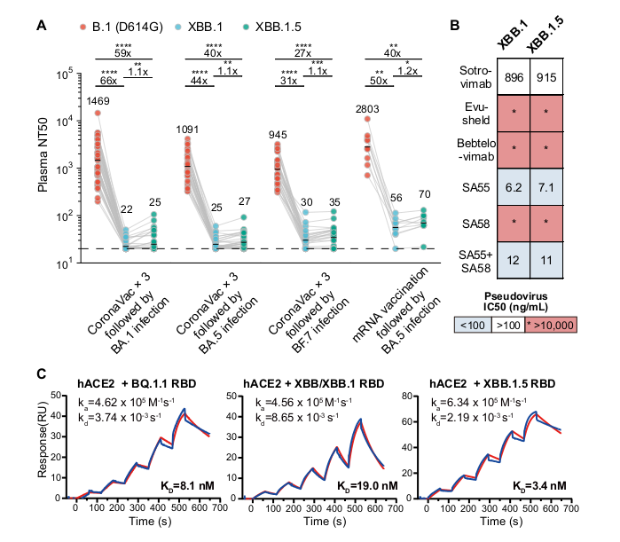 
*Neutralization titers and hACE2 binding affinities of XBB and XBB.1.5 variants. (Fig 1 from [Cam Yua and colleagues](https://www.biorxiv.org/content/10.1101/2023.01.03.522427v2))*

XBB and descendants (22F in Nextstrain nomenclature) were dominant in South Asia earlier this fall and also contributed significantly to circulation in South- and Central America.
XBB.1.5 rose rapidly in frequency in the North East of the USA and has been dominating there since mid-December.
Outside of the North East of the US the variant is still sub-dominant, but increasing.

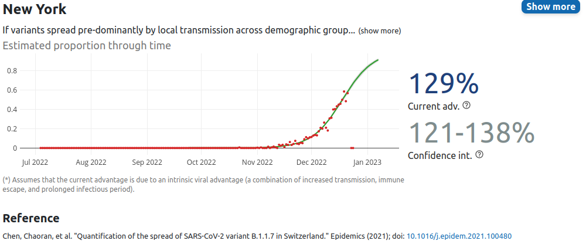 
*XBB.1.5 is dominating in New York and the logistic extrapolation puts its current frequency between 80% and 90%. See [Cov-Spectrum](https://cov-spectrum.org/explore/United%20States/AllSamples/Past6M/variants?nextcladePangoLineage=XBB.1.5) for up-to-date statistics based on data ub GISAID.*

In Europe, XBB.1.5 is still rare.
[CoV-Spectrum](https://cov-spectrum.org/explore/Europe/AllSamples/Past2M/variants?nextcladePangoLineage=xbb.1.5*&) currently lists 267 XBB.1.5 from Europe, corresponding to about 1% of all data submitted in the second half of December.
The frequency has been doubling roughly every week and if these trends continued we would thus expect around 3-6\% in the first half of January.
XBB.1.5 is observed across the continent with slightly higher proportions in the UK and the Netherlands.
As expected, phylogenetic analyses indicate many introductions of XBB.1.5.

There is little conclusive information on severity of XBB.1.5 compared to other circulating variants, but cases and hospitalizations have risen across the USA and not only in regions where XBB.1.5 is dominant.
This is an early tentative sign that the severity of XBB.1.5 infections is not substantially different from other current variants.

# Variant report 2023-01-02

## The surge in China is dominated by BA.5.2 and BF.7

 * **Circulation in China is dominated by BA.5.2 and BF.7**
 * **Sequences obtained from travellers from China support BA.5.2 and BF.7 as main variants**
 * **The BA.5.2 and BF.7 clusters from China have considerable diversity consistent with several months of circulation.**
 * **Isolated observation of other lineages might reflect global diversity sampled in Chinese quarantine facilities**
 * **No highly mutated sequences have been submitted**

Over the last two weeks, about 600 sequences with collection dates after Nov 1st 2022 from mainland China have been deposited in GISAID.
Some, in particular those from Shanghai are labeled as imported cases and are ignored here for the purpose of investigating diversity in China.
In addition to cases from China, about 100 sequences obtained from samples from travellers from China to Singapore, South Korea, Japan, Italy, or the US are available.
Taken together, these samples allow a rough assessment of the diversity of SARS-CoV-2 variants circulating in China.
Most of these samples are from Nextstrain clade 22B and more specifically Pango-lineages BA.5.2 and BF.7.

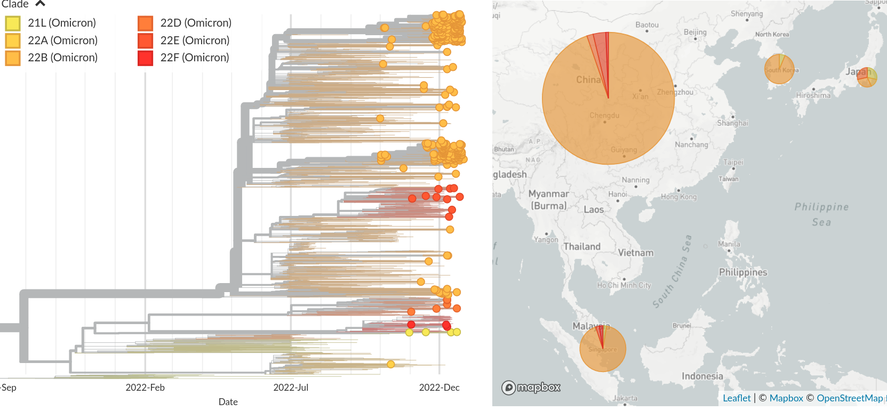
*Overview of samples from China. The two dense clusters are BA.5.2 (top) and BF.7 (middle).*

The top cluster in the above tree is Pango lineage BA.5.2.
The recent sequences suggest that at least two distinct clusters of BA.5.2 are circulating in China.
Both clusters are represented in Chinese data as well as in travel exports.
These two clusters have substantial diversity (sequences are around 5 mutations from the root of these clusters), suggesting they have circulated for several months.
But they remain very similar to global diversity and don't contain highly mutated sequences.
It is unclear whether their common ancestor was in China or whether these two cluster stem from separate introductions.

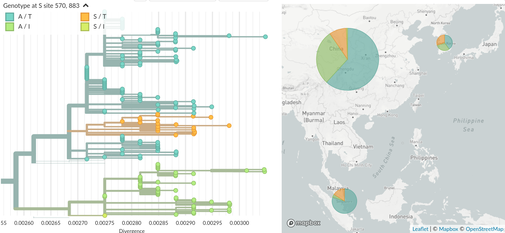
*BA.5.2 fall into two sublineages, one of which carried the mutation T883I in Spike (Green). The other lineages as branch with Spike mutation A570S (Orange).*

The other big group is lineage BF.7. Again, this lineage seems to have acquired substantial diversity in China in the last few months.
The most common mutation is Spike:C1243F.

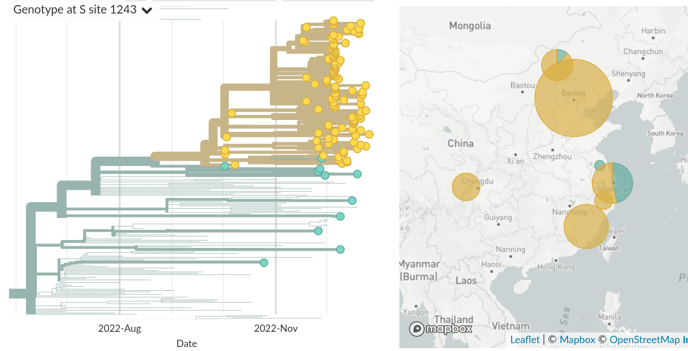
*BA.7 samples mostly come from a group with a mutation at spike position 1243.*

Both of these major BA.5.2 and BF.7 clusters are distributed across China.

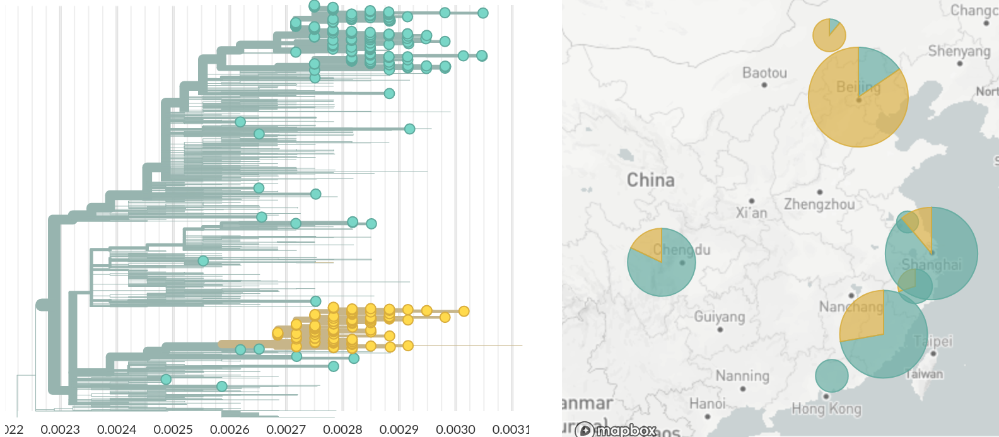
*Both groups (BF.7 yellow, BA.5.2 green) are distributed across mainland China.*

The remaining sequences tend to be isolated in the tree surrounded by global diversity.
They mostly come from Shanghai and Jiangsu.
The lineages they belong to are common globally (BQ.1.1, XBB, BN).
Many of those from Jiangsu originate from the *Nanjing Customs Port Outpatient Department*, which might imply these are samples from incoming travelers.
Similarly, not all samples from Shanghai incoming quarantine facilities might have been identified as such.

### Acknowledgements

The sequence data from China and the traveler data was generously shared via GISAID orginate the following laboratories

 * Shanghai Public Health Clinical Center, Fudan University
 * Fujian Provincial Center for Disease Control and Prevention
 * Beijing Changping Laboratory
 * National Public Health Laboratory, National Centre for Infectious Diseases
 * Sichuan Center of Disease Control and Prevention
 * Beijing Center for Disease Control and Prevention
 * Nanjing Customs Port Outpatient Department
 * Division of Infectious Disease Diagnosis Control, Honam Regional Center for Disease Control and Prevention, Korea Disease Control and Prevention Agency, KDCA
 * Guangdong Provincial Center for Diseases Control and Prevention
 * Laboratory of Microbiology, ASST SetteLaghi, Varese, Italy
 * SARS-CoV-2 testing team, National Institute of Infectious Diseases
 * Jinhua Center of Disease Control and Prevention
 * The Center for Disease Control and Prevention of Inner Mongolia
 * Division of Emerging Infectious Diseases, Bureau of Infectious Diseases Diagnosis Control, Korea Disease Control and Prevention Agency
 * Zhoushan Center of Disease Control and Prevention
 * Center Laboratory of Health Quarantine, Nanjing Customs District P.R. China
 * Hangzhou Center of Disease Control and Prevention
 * Northeastern LSTC
 * Center Laboratory of Health Quarantine, Nanjing Customs
 * The Center for Disease Control and Prevention of Hulunbeier
 * Ordos City Center for Disease Control and Prevention
 * Chifeng Centers for Disease Control and Prevention
 * Baotou City Center for Disease Control and Prevention
 * Chinese National Influenza Center, National Institute for Viral Disease Control and Prevention, Chinese Center for Disease Control and Prevention
 * Division of Laboratory Diagnosis Analysis, Jeju Branch Office, Honam Regional Center for Disease Control and Prevention, Korea Diseases Control and Prevention Agency

They were submitted by

 * Shanghai Institute of Hematology, National Research Center for Translational Medicine, State Key Laboratory of Medical Genomics, Ruijin Hospital Affiliated to Shanghai Jiao Tong University (SJTU) School of Medicine
 * Fujian Provincial Center for Disease Control and Prevention
 * Beijing Changping Laboratory
 * National Public Health Laboratory, National Centre for Infectious Diseases
 * Sichuan Center of Disease Control and Prevention
 * Beijing Center for Disease Control and Prevention
 * Division of Emerging Infectious Diseases, Bureau of Infectious Diseases Diagnosis Control, Korea Disease Control and Prevention Agency
 * National Institute for Viral Disease Control and Prevention, China CDC
 * Jiangsu International Travel Health Care Center, Center Laboratory of Health Quarantine
 * Zhejiang Province Center of Disease Control and Prevention
 * National Institute for Viral Disease Control and Prevention
 * Laboratory of Microbiology, ASST SetteLaghi, Varese, Italy
 * Pathogen Genomics Center, National Institute of Infectious Diseases
 * Center Laboratory of Health Quarantine, Nanjing Customs District P.R. China
 * Center Laboratory of Health Quarantine, Nanjing Customs
 * Ginkgo Bioworks Clinical Laboratory / XpressCheck
 * Chinese National Influenza Center, National Institute for Viral Disease Control and Prevention, Chinese Center for Disease Control and Prevention

# Variant report 2022-12-22

## XBB.1.5  grows fast, in New York state and globally

XBB.1.5 (XBB.1 + S:F486P), first mentioned in every report in this series since 2022-11-11 keeps growing fast and is predicted to be already dominant in New York state in samples collected on 2022-12-22. XBB.1.5 seems to grow by a factor of 2.2-2.5 every week (though these factors tend to decrease slightly as more data becomes available). A doubling per week compared to the average of circulating variants is still remarkable and on the order of Delta vs Alpha.

*Figure 1: Growth of XBB.1.5 in New York state*

The further one moves away from NY state, the less common XBB.1.5 becomes. In Connecticut, Massachusets & New Jersey, XBB is well above 20% at the time of writing. In California, it is around 5%.

Globally, outside the US, XBB.1.5 appears to make up around 0.5-5%. Even Canada does not seem to have much more than 1% yet. Less than 100 of the 1400 XBB sequences have been collected outside the US, so it is not yet possible to confirm the growth advantage in other countries.

Given the strong growth advantage that S:486P seems to confer in the XBB backbone, it is not unlikely that it arises independently - though at this point there is no clear evidence for such a lineage, yet.

## No recent sequences from mainland China, sparse traveler data

Given the reported surge in infections in mainland China, it is of particular interest what the circulating variants are. However, there is a total lack of recent sequences from community circulation in mainland China. The 15 sequences submitted to GISAID with collection date since 2022-09-01 are apparently from travellers to China, they are annotated as `Nanjing Customs Port Outpatient Department, Jiangsu International Travel Health Care Center, Center Laboratory of Health Quarantine`.

There are around 400 sequences from Huanan with collection date in August 2022. These are all BA.5.1.3.

Due to the lack of sequence submissions from China, the best information available is via sequences that have been annotated as coming from a traveler who had been to China - though it is not known with certainty that travelers actually got infected while in China.

Singapore has submitted 3 sequences with collection date in December 2022 that are annotated as `With travel history to China`. It is not certain that this means `mainland China` as Hong Kong, Macau and Taiwan could also be referred to as `China`. These sequences are BA.5, BA.5.1 and BA.5.2 respectively.

With collection dates in November 2022, there are 7 sequences uploaded from Singapore (3), Japan (3), South Korea (1). The lineages represented are:

- 3 x BA.5 (BA.5.1, BA.5.2, BA.5.6)
- 1 x BQ.1.22 (BQ.1 with S:R346T)
- 1 x XBB.1
- 1 x CH.1.1
- 1 x BA.2.3.20

For collection date October, the following lineages were reported in travelers: BA.5.2.20, BF.5, CM.3

These lineages are typical for circulation in Asia. It is interesting, though, that out of 13 sequences, BA.2.3.20* appears twice. BA.2.3.20 has only been found at above >5% in the Philippines. Yet, 13 sequences from travelers from China are too few to allow for any conclusions.

# Variant report 2022-12-15

## General picture

The trend of increasing diversification continues. BA.2 was the last variant that became nearly dominant all around the world.

Since then, different regions have had different distributions of variants. 22B (BA.5\*) got close to dominant in most regions except on the Indian subcontinent, where 22D (BA.2.75\*) took off before 22B got fully established.

22E (BQ.1\*) grew fast when it arrived in Africa, Europe and the Americas, but has recently culminated at between 25-75% share in Europe and North America.

22F (XBB\*) appears to have almost fixed on the Indian subcontinent, however, this is not true of other regions it spread to. 22F quickly grew to around 50% in Singapore but it has remained there at that level since.

22D (BA.2.75\*) has been growing in share compared to 22E (BQ.1\*) in Europe and North America, but it has not yet reached dominance.

Overall, there seems to be no clear winner. There appears to be an equilibrium of continuous antigenic evolution, that is:

- fast enough that there is a turnover of lineages every few months
- yet slow and homoplasic enough that
  - replacements cause moderate rather than dramatic waves
  - and that no single lineage dominates globally

For example, BF.7\* grew close to exponentially in Europe from first detection in May 2022 until September 2022, reaching a maximum of 12% share in Europe at the end of October. Yet, due to the evolution of fitter lineages, BF.7\* has since shrunk at an increasing pace to around 5% at the end of November. By the beginning of 2023, there will be not much BF.7\* left.

Without antigenic evolution, case numbers would hence be much lower than they currently are.

## Fastest growing lineages

- CH.1.1 (BA.2.75 + S:R346T, S:K444T, S:L452R, S:F486S)
  - Doubling every 1-2 weeks
  - Makes up around 5% of global sequences at the beginning of December.
  - Particularly common in New Zealand (~20%), Thailand (~10-20%), UK (~5-10%)
- XBB.1.5 (XBB.1 + S:F486P)
  - Doubling every week or faster
  - Makes up around 1% of global sequences at the beginning of December.
  - Particularly common in New York state (~10-20%) and the US east coast
- BQ.1\* + S:R346T + S:Y144-
  - Doubling every 2 weeks
  - ~10% of global sequences at the beginning of December.
  - Particularly common in Europe (~10-20%), only 2% in the US

## Lineages of interest

### XAY

XAY, a Delta-Omicron recombinant previously mentioned, has been circulating in South Africa at ~1-5% since June 2022, where it neither seems to disappear nor grow above that ~5%.
It was first detected in Denmark in September 2022 where it has been doubling every 2 weeks and now makes up 2% of all sequences in Denmark.
XAY has also been detected sporadically in increasing numbers in other European countries and globally.
What differentiates XAY from other growing lineages is that it has apparently not undergone any significant antigenic evolution in the Spike protein. Nonetheless, it has been growing at a steady pace in Denmark.
One possible explanation for this unusual behaviour may be that Denmark never had a significant BA.1 wave.

### BA.2.3.20

BA.2.3.20 is of interest as it appears to be rather different from the other major variants like BA.5\*, BA.2.75\* and XBB\*. It makes up around 1% of global sequences. Overall, it doesn't appear to grow, however, it has sublineages like CM.8.1 that *are* doubling at least every 2 weeks. Interestingly, RBD mutation S:G485D is very homoplasic in BA.2.3.20 while hardly seen in other variants. This may be due to epistasis with S:484R, which is defining for BA.2.3.20.

## Thoughts on S:F486P

The 2-step RBD mutation S:F486P, discussed previously, appears to confer a significant growth advantage on the order of ~50%/week, potentially larger than that of S:R346T seen in the past.

S:F486P is already present in many lineages (XBB.1.5, XBF/CJ.1, XAY, XBC, CH.3) and is otherwise reachable in one step for a large number of lineages in the BA.2.75\* and BA.2.3.20\* families, those with S:F486S.

In contrast, S:F486P is very hard to reach for lineages deriving from BA.4/5, requiring 2 steps, one of which is a rare G->C, since 486 is mutated to V in BA.4/5.
The shortest path from V to P goes via either L or A. L has globally only been observed 8 times with BA.5\* making this path very unlikely.
A on the other hand has been observed, most notably in BW.1.1 which makes up around 10% of sequences in Mexico (S:Y144-, S:K444T, S:N460K, S:F486A)
However, to get from A to P still requires the rare G->C mutation. And BW.1.1 notably lacks S:R346T.
This relative difficulty of reaching S:F486P for BA.5\* lineages may cause it to be outcompeted in the mid-term by BA.2.75\*, XBB\* and potentially BA.2.3.20\* or XAY.

# Variant report 2022-11-23

## Macro trends

Only a handful of broad variants and their descendants dominate global circulation.

### BA.5 (Nextstrain clade 22B)

BA.5 and its children is the dominant variant in Africa, Europe and the Americas where it is responsible for around 80% of infections. The fastest growing child lineage is BQ.1 (22E) in particular with extra mutations S:R346T and S:Y144- a combination that has arisen multiple times independently.

### BA.2.75 (22D)

BA.2.75 and child lineages is particularly common in South Asia (India, Bangladesh) where it accounts for between 20 and 80% of infections. The fastest growing child lineages are CH.1.1 and to a lesser extent CJ.1/XBF and BN.1.

### XBB (22F)

XBB can now be considered a separate macro variant due to its significant spread in South Asia (India, Bangladesh, Singapore, Indonesia) where it accounts for up to 80% of infections, depending on location. Antigenically mutated sublineages have emerged, most notably XBB.4 (S:K444R) common in Indonesia and XBB.1.5 (S:486P) which is growing on the US east coast.

### BA.2.3.20

BA.2.3.20 appears to be the dominant variant in the Philippines and has spread worldwide, making up between 0.5 and 5% of infections in most countries. It has independently evolved S:F486S multiple times, resulting in lineages that appear competitive (CM.2.1, CM.7, CM.8.1)

### XBC, XAY, BS.1

Besides remnants of BA.4 that are fast disappearing, three further variants are worth mentioning.

XBC is a Delta-Omicron recombinant that appears to be most common in the Philippines and Brunei, circulating at a prevalence of around 5%. Sublineage XBC.1 (S:L452M) has been rising in Australia to most recently 1%.

XAY is a Delta-Omicron recombinant that has been continuously circulating at low levels of around 1-3% in South Africa since first detection in June 2022. Sublineage XAY.2 seems to have established itself in Denmark as well, where it has been sequenced at least 30 times. It has been detected sporadically around the world, e.g. in the US, South Korea

BS.1 appears to have been close to being the dominant lineage in Vietnam. It has however hardly spread much beyond Vietnam.

## Convergent evolution of S:486P - a 2 step mutation

Spike substitution S:F486P has started to grow fast in recent weeks. It is distinctive by requiring two nucleotide substitutions: T23018C and T23019C. The transition from F to P has usually happened through the common intermediate S. It has evolved at least half a dozen times independently in a number of lineages: XAY, XBC, CJ.1 (= Spike donor of XBF), BA.2.10.4, XBB.1.5, CA.4.

Based on Jesse Bloom's ACE2 binding calculator, S:486P is predicted to significantly boost ACE2 binding affinity - which could explain the recent emergence, given that the intermediate has only recently been present in measurable numbers. Until June 2022, S:486S had only been sequenced 161 times, essentially background noise. Since June 2022, S:486S has been sequenced more than 14 thousand times.

## Lineages potentially worth studying in the lab

Among the many new lineages, a few stand out due to growth and spike mutations:

The following three have immediate potential for dominance:

- [BQ.1 + S:R346T + S:Y144-](https://cov-spectrum.org/explore/World/AllSamples/Past6M/variants?aaMutations=S%3AR346T%2CS%3A144-&nextcladePangoLineage=BQ.1*&): ~5% globally, doubling every week, found in multiple lineages: e.g. BQ.1.18, BQ.1.10/20/21/22/25
- [CH.1.1](https://cov-spectrum.org/explore/World/AllSamples/Past3M/variants?nextcladePangoLineage=CH.1.1*&): ~1% globally, doubling every week, extra Spike mutations S:R346T, S:K444T, S:L452R, S:F486S on top of BA.2.75
- [XBB.1.5, extra S:S486P](https://cov-spectrum.org/explore/World/AllSamples/Past3M/variants?nextcladePangoLineage=XBB.1.5*&): 43 sequences since first upload 7th of November, mostly US east coast, but 1x in Denmark/Switzerland each, too early to tell growth advantage but appears significant

The following four are interesting due to growth and being different from the above:

- [CJ.1/XBF](https://cov-spectrum.org/explore/World/AllSamples/from=2022-06-01&to=2022-11-30/variants?variantQuery=nextcladePangoLineage%3ACJ.1*+%7C+nextcladePangoLineage%3AXBF*&): Growing in Australia and Denmark, the spike of XBF is identical to CJ.1, extra S:486F->S->P, S:R346T, S:F490S on top of BA.2.75
- [XBC.1](https://cov-spectrum.org/explore/World/AllSamples/from=2022-06-01&to=2022-11-30/variants?nextcladePangoLineage=XBC.1&): Delta-Omicron recombinant that is growing in Australia, extra Spike mutation S:L452M on top of XBC
- [XAY.1](https://cov-spectrum.org/explore/World/AllSamples/from=2022-06-01&to=2022-11-30/variants?nextcladePangoLineage=XAY.1*&): Delta-Omicron recombinant that keeps circulating in South Africa, extra S:D253G on top of XAY
- [CM.8.1](https://cov-spectrum.org/explore/World/AllSamples/Past3M/variants?nextcladePangoLineage=CM.8.1*&): BA.2.3.20 with S:G446S and S:F486S, growing among others in Japan, California

# Variant report 2022-11-11

The general trend towards step-wise antigenic drift as opposed to evolutionary jumps continues. The same key mutations keep appearing in different lineages in new or identical combinations.

## BQ.1 diversity

Among BQ.1\*, most of the fastest growing lineages have acquired both S:Y144- and S:R346T. Both mutations have arisen multiple times independently. BQ.1.1 is the biggest sublineage that has S:R346T but it is by far not the only one. As a result it appears to be more useful to study haplotypes of BQ.1 sublineages rather than distinct lineages at this point.

Interestingly, S:144- appears to provide as much of a growth advantage if added on top of BQ.1 as S:R346T does.

Nowcasting haplotype prevalence (using the logistic fit from covSpectrum), S:346T is present in around 2/3 of all BQ.1\*. The deletion S:Y144- is present in around 30% of all BQ.1\*.

Both mutations together currently appear in around 15% of all BQ.1\* globally. The relative growth advantage of this haplotype compared to all BQ.1\* is around 5% per day which corresponds to a doubling time of around 2 weeks.

Within BQ.1.1, two level 8 lineages have recently been designated but it is too early to say how fast (if at all) they will grow. Both lineages notably lack the S:144- deletion.

- CZ.1 (aka BQ.1.1.1.1) with extra S:F490I has been sequenced in 4 countries, once each: England, South Korea, Austria and Romania and is predicted to be more immune evasive than BQ.1.1
- CW.1 (aka BQ.1.1.14) with extra S:G446S has been sequenced 8 times in England

## XBB still in the race

While it appears that BQ.1\* with S:144- and S:346T is growing faster in Europe and North America than XBB, it remains unclear whether the two variants could coexist in the mid term.

Some sublineages with interesting RBD mutations are:

- XBB.1.3 with A484T
- XBB.1.5 with F486P (XBB has F486S)
- XBB.4 with K444R
- XBB.4.1 with K444R and T470N

## BQ.1 + S:144- + S:R346T potentially fitter than XBB but co-circulation possible

It is still unclear BQ.1 + S:R346T + S:144- will fare against XBB* lineages.

In Singapore, where XBB has been dominant for a week weeks, XBB\* has stopped growing at around 2/3, the rest is made up of various BA.5 and BA.2.75 lineages. This could be a sign of immunity becoming more heterogeneous in the population which could give rise to co-circulating strains. But it is too early to tell with any degree of confidence. BQ.1\* is growing but still in single digit percentages.

BQ.1\* has been dominant in Nigeria for multiple weeks. However, sequencing is sparse and no XBB\* has been found there yet, so we cannot learn anything about cross-reactive immunity from there. Hence there is no country yet whose data can be used to learn about what significant BQ.1\* circulation could mean for XBB\*'s prospects.

## New lineages worth watching

There are a number of new sublineages that have a large predicted immune escape and sufficient ACE2 affinity as well as demonstrated growth advantage:

- CH.1.1 (aka BM.4.1.1.1.1 aka BA.2.75.3.4.1.1.1.1) has F486S, R346T, K444T, L452R in addition to BA.2.75 RBD mutations, it has appeared globally without clear origin [~150 sequences as of 2022-11-11]
- CJ.1 (aka BM.1.1.1.1 aka BA.2.75.3.1.1.1.1) has F486S -> S486P, R346T, F490S in addition to BA.2.75 RBD mutations [~30 sequences as of 2022-11-11]
- XBF, an Australian recombinant of BA.5.2.3 and CJ.1, with the RBD being that of CJ.1

# Variant report 2022-10-26

## Evolutionary trends within BQ.1.1 and XBB

It continues to be unclear which of BQ.1.1 or XBB will turn out to be fitter. There is still not enough data from countries with co-circulation, yet.

However, some evolutionary trends within BQ.1* and XBB are worth discussing.

### BQ.1* keeps acquiring beneficial mutations S:R346T and S:Y144-

Mutation S:R346T is not unique to BQ.1.1, it has been acquired independently in at least 2 other BQ.1\* sublineages: BQ.1.9 and BQ.1.18 which together make up less than 10% of all BQ.1\* with S:R346T.

Besides S:R346T, the other major mutation that seems to confer a significant growth advantage on a BQ.1\* backbone is S:Y144-. This deletion has been acquired independently at least a dozen times and seems to confer a significant additional growth advantage. Due to the large number of independent acquisitions, and the fact that Usher is blind to deletions, few Pango lineages defined by S:Y144- have been designated to date, the exceptions being BQ.1.18 and BQ.1.1.10.

Interestingly, relative growth advantage estimates conferred by S:144- seem to be higher when S:R346T is also present. While this could be a statistical artifact, it is also plausible that in the presence of S:R346T the remaining neutralizing antibodies bind particularly to the N-terminal domain which S:144- could disrupt.

In samples collected in early October, in BQ.1* *without S:R346T*, S:144- was present in ~15% of them, with relative growth advantage of S:144- of at around [3-5%/day](https://cov-spectrum.org/explore/World/AllSamples/Past2M/variants?variantQuery=nextcladePangoLineage%3ABQ.1*+%26%21+S%3A346T&variantQuery1=nextcladePangoLineage%3ABQ.1*+%26+S%3A144-+%26%21+S%3A346T&analysisMode=CompareToBaseline&).

In BQ.1* *with S:R346T*, S:144- was present in ~10% of them, with relative growth advantage of S:144- of at around [7-12%/day](https://cov-spectrum.org/explore/World/AllSamples/from=2022-09-01&to=2022-10-19/variants?variantQuery=nextcladePangoLineage%3ABQ.1*+%26+S%3A346T&variantQuery1=nextcladePangoLineage%3ABQ.1*+%26+S%3A144-+%26+S%3A346T&analysisMode=CompareToBaseline&).

With only 200 BQ.1* with S:R346T and S:Y144- in GISAID by 2022-10-26 there are no reliable growth advantages yet. This mutation combination seems to be particularly common in France and makes up a bit more than 1% of total sequences at the beginning of October.

Beyond BQ.1\*, the combination of S:144- and S:R346T has appeared in CR.1 (aka BA.5.2.18.1), BA.4.6.3, CQ.1/2 (BE.4.1.1.1/2) - all of which also have mutations at S:K444, as well as BS.1 (BA.2.3.2.1), BJ.1 (BA.2.10.1.1) and XBB.

### XBB sublineages with mutations S:G252V or S:D253G dominate

XBB.1 defined by S:G252V and ORF8:8\* (stop) makes up more than half of all recent XBB sequences. XBB.2 has independently evolved S:D253G and now makes up around 5% of all XBB sequences. The independent success of two mutations in such proximity is indicative of a growth advantage conferred by mutations at this position.

### Other BQ.1* and XBB lineages to monitor

Beyond the mutations and lineages mentioned above, some lineages with mutations of interest but small number of sequences are:

- BQ.1.1.11/12 with S:494P in addition to BQ.1.1-defining S:R346T
- BQ.1.1.2 with S:D253G in addition to BQ.1.1-defining S:R346T
- BQ.1.1.9 with S:S151I in addition to BQ.1.1-defining S:R346T
- XBB.1.3 with S:A484T in addition to XBB.1-defining S:G252V
- XBB.4 with S:K444R
- XBB.3.1 with S:Q677R

## Other lineages of interest with high predicted immune escape

Besides BQ.1\* and XBB, there are other lineages that are predicted to have high immune escape (by the Bloom et al. escape calculator):

- BN.1\* with S:A475V (1x Iceland, 1x Austria)
- BN.1.2.1 defined by S:T470N (19 sequences, mostly England)
- CH.1.1 (aka BM.4.1.1.1.1 aka BA.2.75.3.4.1.1.1.1), a level 7, with S:R346T, S:K444T and S:L452R and S:F486S in addition to BA.2.75-defining mutations, 47 sequences
- BQ.1.1 with S:G446S (2 clustered English sequences, level 7)

## 4-AA insertion N:211ins:SESF found in 900 BA.5.1.3 sequences

Ryan Hisner has noticed that a 4 amino acid insertion occurs in about 10% (that is 900 sequences) of the BA.5.1.3 lineage. However this insertion does not seem to confer a growth advantage. The insertion has been present at a stable ~10% of BA.5.1.3. See more details on the [pango-designation issue](https://github.com/cov-lineages/pango-designation/issues/1249).

# Variant report 2022-10-17

## Various immune evasive variants are dominant around the world

Various immune evasive variants have evolved around the world and are in the process of becoming dominant.

Due to a large degree of convergence, this time, it is not just one variant that goes around the globe - but different regions have different variants, depending on where a variant first arose.

Two variants stand out in particular: BQ.1.1 and XBB.

Both variants are found to evade neutralizing antibodies produced by vaccine and/or (breakthrough) infection. The best data at the moment comes from Yunlong Cao's group which keeps their preprint updated as new data is generated for novel lineages: <https://www.biorxiv.org/content/10.1101/2022.09.15.507787v3>.

Both variants notably evade antibodies produced after breakthrough infection with BA.5, see the figure:

_Figure 1: BQ.1.1 and XBB evade antibodies produced after breakthrough infection with BA.5. Source: [@YunlongCao](https://twitter.com/yunlong_cao/status/1577343564572659712?s=20&t=rmsPt8YhfYSRW6-X2_8hsw)_

### BQ.1.1 not far from dominance in Europe and North America

BQ.1.1 is on the rise mostly in Europe and North America. It has a growth advantage of between 10-15%/day relative to its BA.5 ancestor, which corresponds to a doubling every week while the lineage is in the exponential phase of logistic growth.

BQ.1.1 was first sequenced in Nigeria, but given the low number of sequences from neighboring countries, the exact origins are not clear. In Europe, the country with the largest share of BQ.1.1 seems to be France, where it could make up around one third with sample dates mid October. In other European countries, the share at the moment is projected to be on the order of 5-20% in samples collected mid October.

In North America, BQ.1.1 is projected to make up around 10% of samples collected mid October.

With a doubling time of around one week, BQ.1.1 is on track to become the dominant variant in Europe and North America in the next 2-4 weeks. It is possible though that other similarly fit variants will grow similarly fast, which may lead to BQ.1.1 to stop growing before it reaches 100%. This however does not mean that the impact on infection numbers will be less, in contrast, if other variants grow as fast as BQ.1.1, the impact of infection numbers will happen sooner.

In Asia and Oceania, BQ.1.1 makes a smaller share of sequences, between 1-5%.

### XBB appears dominant in some countries in Asia

XBB was first detected in sequences from Singapore, India and Bangladesh. It is a recombinant of two second generation BA.2 (neither parent derives from BA.4/5): BJ.1 and BM.1.1.1 (BA.2.75.3.1.1.1).

BJ.1 never spread much worldwide due to not being competitive with other variants circulating at the time, e.g. BA.2.75 and BA.4/5 sublineages. It was most commonly found in Bangladesh where it seems to have peaked at around a third of sequences at the end of August. It was also detected in India, albeit only at a low share of around 2%.

BM.1.1.1 is a descendant of BA.2.75 with 3 key receptor binding domain mutations: S:R346T, S:F486S, S:F490S in addition to the ones BA.2.75 already contains. It reached the highest share in Bangladesh (around a third) and India (~2%) towards the end of August.

The geographic distribution of XBB's parents suggests that the recombination event happened in Bangladesh, India or neighboring countries that do not sequence much.

XBB has grown very fast on the Indian subcontinent and Singapore. It seems to be dominant in Bangladesh and Singapore already and makes up well above 10% of sequences in India, where it is expected to become dominant soon.

The growth advantage of XBB appears to be of the same order of magnitude as that of BQ.1.1, though the estimates are more uncertain due to less data being available and the recent emergence.

XBB has been detected in most countries around the world with a thousand or more sequences with collection date in the last month.

### How XBB and BQ.1.1 compare is not clear yet

Due to different regional foci of XBB and BQ.1.1, it is not possible to reliably compare whether one variant may be fitter than the other. Two scenarios are possible:
a) One variant may be fitter and outgrow the other globally
b) Both variants are similarly fit and antibodies against one variant do not protect as well against the other as against itself: in this case co-circulation is a possibility.

Countries to watch are in particular: Australia, Japan and South Korea, as they have a similar share of BQ.1.1 as of XBB. Data from these countries could show whether which variant grows faster when cross-immunity is not (yet) a factor.

Countries where one of the variants has become dominant, on the other hand, will allow to judge the degree of cross-immunity. The countries to watch for this are first and foremost Singapore where XBB is already dominant and which generates timely sequence data; and Europe/North America where BQ.1.1 is expected to become dominant and where XBB is also already present at around a 1%.

Furthermore, sera from people who have been infected with BQ.1.1 and/or XBB can be tested for cross-reactivity against the other variant.

Both XBB and BQ.1.1 have a significant number of differences in Spike, almost comparable to the difference with Delta:
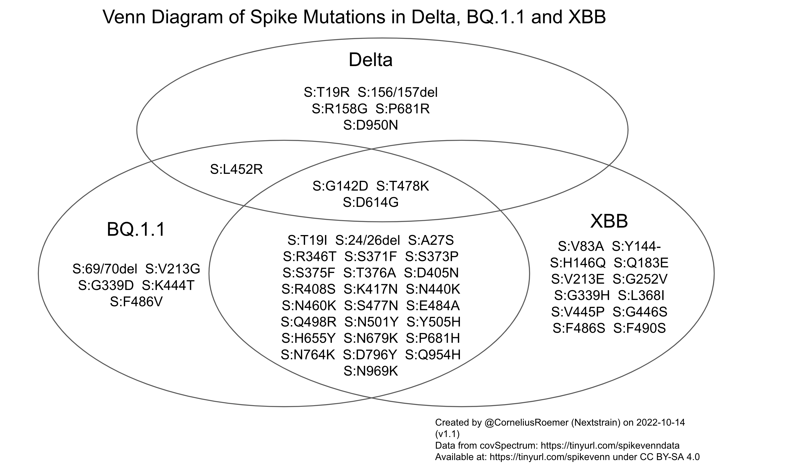

## Making sense of the variant soup by counting key mutations

It is important to bear in mind that BQ.1.1 and XBB are not the only variants that are growing in share around the world. There are many lineages with very similar mutation profiles that are growing almost as fast. These other lineages also contribute to variant driven case growth.

Evolution until recently has been mostly driven by singular variants that grew without similarly fit variants present. For example, when Alpha first emerged, it was the fittest variant by a good margin in Europe. Similarly with Delta, and BA.1, BA.2 and BA.4/5.

This time is different, it is no longer sufficient to consider a single variant when trying to predict when variants will start impacting case growth. It is necessary to consider the whole collection of fast growing variants.

One way to group variants is by counting the number of novel key mutations (in addition to BA.2's) in the receptor binding domain (RBD) that are known to lead to immune escape while not harming the virus's ability to bind to human cells at the ACE2 receptor. Since evolution in this area currently appears to be the most important driver of variant fitness, simply counting these mutations can be useful to broadly classify variants to get a sense of how common various levels of immune escape are in different countries and at different points in time.

The following list of key RBD mutations was derived from a combination of sources:
a) Jesse Bloom's immune escape calculator using data from Yunlong Cao's group
b) Observing which mutations often seem to arise in lineages with current growth advantage
c) Mutations that were commonly found in chronic infections as detected in waste water by Marc Johnson

The list is not perfect, the impact of a mutation is not binary, some are more important than others, but it is surprisingly effective at classifying variants with similar growth advantages:

- S:R346T/S
- S:K356T
- S:K444T/R
- S:V445P
- S:G446S
- S:N450D
- S:L452R
- S:N460K
- S:F486S/V/L/P
- S:F490S
- S:493rev
- S:S494P

Assigning different lineages to "levels" based on how many of these mutations they contain, leads to the following classification of some example lineages:

- Level 0: Stock BA.2
- Level 1: BA.2.12.1, and others with S:L452R/Q/M
- Level 2: BA.2.74, BH.1
- Level 3: Stock BA.4/5; BA.2.75; BA.2.77
- Level 4: BA.4.6, BF.7, BA.5.9; BA.2.75.5, BL.1, BL.2
- Level 5: BQ.1, BU.1, BW.1; BA.2.75.2, BM.1.1; BA.2.3.20, BJ.1, BS.1
- Level 6: BQ.1.1; BN.1, BM.1.1.1
- Level 7: XBB (BJ.1 x BM.1.1.1), CJ.1 (BM.1.1.1 with S:486P)
- Level 8: None designated yet

On covSpectrum, there is a collection that has pre-composed queries for these levels, so that it's easy to check how common variants with at least a certain number of key mutations are: <https://cov-spectrum.org/collections/54>

Plotting the share of variants with at least N mutations on that list looks like this for worldwide data:

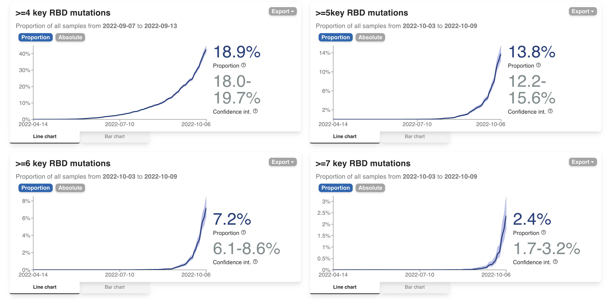
_Figure 2: Share of variants with at least N key mutations in the RBD worldwide, source: [covSpectrum collection 54](https://cov-spectrum.org/collections/54)_

The gist is: the more key RBD mutations, the faster the growth but the lower the share (as expectable, because anything with >= 5 mutations is automatically in the category of >= 4.

An alternative way to plot is to use exact counts of mutations. In that case, the curve can go down, as higher levels are not included in lower levels. This is what it looks like for 0-3 mutations:

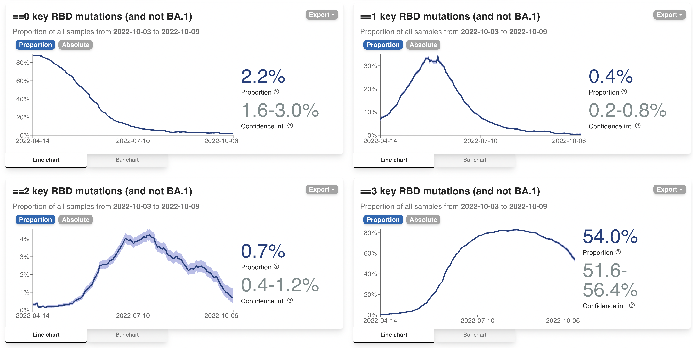
_Figure 3: Share of variants with exactly N key mutations in the RBD worldwide, source: [covSpectrum collection 54](https://cov-spectrum.org/collections/54)_

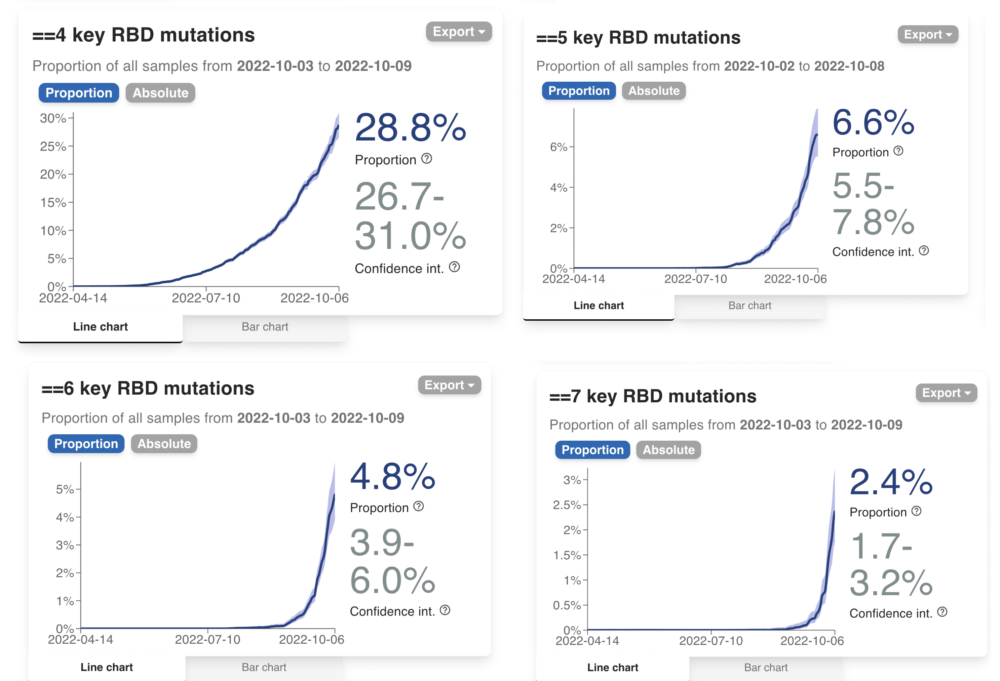
_Figure 4: Share of variants with exactly N key mutations in the RBD worldwide, source: [covSpectrum collection 54](https://cov-spectrum.org/collections/54)_

BA.2 (0 extra key RBD muts relative to BA.2) was dominant in April, but replaced by BA.2.12.1 (1 extra key RBD mut relative to BA.2 = S:L452Q). Variants with 2 extra mutations relative to BA.2 never became dominant because BA.4/5 (3 extra muts) arose and became dominant. Variants with 4 extra muts, e.g. BF.7/BA.4.6 (BA.4/5 with extra S:R346T) are now on the verge of becoming dominant but may get overtaken by varies higher level variants.

### Trend from long branch variants to step wise evolution and recombination

There seems to be a change in the main mode of evolution. Until recently, novel variants predominantly arose on long branches where intermediates were either not circulating or only at low levels, e.g. Alpha, Beta, Gamma, Delta, Omicrons BA.1/2/4/5, BA.2.75

Now, the main mode of evolution seems to be stepwise addition of receptor binding domain mutations. This has been observed now in both BA.2.75 (e.g. BA.2.75.2, BN.1, BM.1.1.1) and within BA.4/5 (BA.4.6, BF.7, BQ.1(.1), ...).

Interestingly, XBB is the first recombinant with a significant growth advantage, becoming regionally dominant, that has arisen from known parents. While various Omicron lineages likely involved some degree of recombination, this recombination could have occurred during the long branch phase, before the parents (donors) were in broad circulation.

It will be interesting to see if this trend continues, where stepwise evolution is the main mode, together with recombination between various step-wise evolved lineages.

In contrast to long branch variants and recombination, step wise evolution is more predictable. Since recombination, which is more stochastic, seems to remain important, at least for the time being, there remain uncertainties in the evolution of SARS-CoV-2.

## Non-RBD mutations may play an increasing role

The main difference between BQ.1.1 and XBB seems to be in the number of non-terminal domain (NTD) mutations that XBB has (due to being partially derived from BJ.1 which had many mutations there).

There seems to be an increasing selection pressure for NTD mutations, though there seem to be a broader range of sites at which these mutations can be beneficial, e.g. around positions S:248-253, around S:210, and around S:140-160. In particular, the S:Y144- deletion seems to arise frequently in BQ.1.1 and other recent lineages and could potentially provide an additional growth advantage.

It is plausible that with the RBD evolving to escape neutralizing antibodies, the NTD will become a relatively more important target for neutralizing antibodies - which in turn could lead to increased selection pressure for NTD mutations.

There is also evidence that mutations outside of Spike play a role. However, there has been less systematic analysis of these mutations to date.

## Growth advantage estimates and variant share projections

Tom Wenseleers and Moritz Gerstung continue to update their growth advantage estimates for novel variants. Models from both scientists show that BQ.1.1 has a growth advantage above 10% per day. Moritz Gerstung further showed that the recent infection wave in Germany was not (yet) driven by novel variants and that a significant contribution of variants to case growth is yet to come until end of November (for Germany).

See their threads for more details:

- Moritz Gerstung's with estimates based on German data: <https://twitter.com/MoritzGerstung/status/1580222575866564608?s=20&t=Pfphgp0lMBhomNZhS_NaVw>
- Tom Wenseleers' with estimates based on global data: <https://twitter.com/TWenseleers/status/1580701680840024065?s=20&t=Pfphgp0lMBhomNZhS_NaVw>

# Variant report 2022-09-28

## BQ.1 has kept doubling every week, may become dominant by the end of November

BQ.1, a BA.5 sublineage with S:444T and S:460K, continues to grow fast and is on track to become the dominant lineage in Europe in samples collected by the end of November. Two weeks ago, there were just 119 sequences in GISAID, collected world wide. Today, on the 29th of September, there are already 692.

It is plausible that the daughter lineage BQ.1.1 with additional S:346T will grow even faster. Samples in GISAID have gone up from 29 two weeks ago to 213 as of today.

The relative growth rate of BQ.1 in the current BA.5 background is on the order of a doubling in share every week. BQ.1 made up around 1% of samples collected in Europe and North America in the middle of September.

BA.2.75's various sublineages, including BA.2.75.2, continue to show a substantial growth advantage over circulating BA.5 - however, BQ.1 appears to grow faster. In Europe and North America, the proportion of BA.2.75\* and BQ.1 is already roughly similar, despite BA.2.75\* having been present two months earlier. In Asia, there is still much more BA.2.75\* than BQ.1.

Tom Wenseleers calculates a growth advantage over BA.5.2 of just below 14% per day for BQ.1, whereas BA.2.75.2 comes in lower at around 9% per day. This is consistent with BQ.1 doubling in share every week.

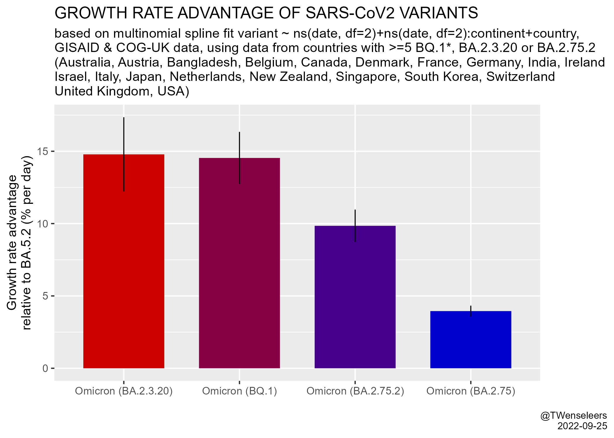

(from <https://twitter.com/TWenseleers/status/1574070423175966720?s=20&t=bNy5CvKmfDwXOIhIVB6z5g>)

There are other members of the BA.2.75\* family that could still outcompete BA.2.75.2 but the data is too scarce at this point to draw conclusions. One candidate is BN.1 which has the immune escape substitution S:356T in addition to the S:346T shared with BA.2.75.2.

Based on recent data from Nigeria, BQ.1 seems to have become dominant there at the end of August.

## Other new variants of interest

As mentioned in previous reports, the same mutations keep arising independently. This report can only focus on the lineages that appear to show the highest growth advantage and are present in the largest numbers at this point.

BA.2.3.20, a variant that seems to be most common in an under sampled area in South East Asia, keeps growing at a similar pace as BQ.1, albeit with lower absolute numbers to date. On GISAID there are 142 today with doubling time of uploads of about a week, similar to BQ.1. In Tom Wenseleer's analysis (see above), BA.2.3.20 has a similar growth advantage as BQ.1.

Another lineage to keep an eye on is the recombinant XBB, which has BJ.1 and BM.1.1.1 (a BA.2.75\* lineage) as donors with a breakpoint in the middle of the RBD (around S:450-460). The first sample was uploaded to GISAID on the 11th of August. Today there are already 50 sequences. It appears to be most common in Bangladesh and the East of India. With such low numbers, doubling times are hard to estimate.

Very recently, a Delta(21I)-BA.2 recombinant designated as XBC has been sequenced multiple times in the Philippines and also globally in the US, Austria and South Korea. With just 12 sequences to date, all uploaded since the 20th of September, it is too early to say whether this lineage will be able to compete.

The "Great Convergence" of similar mutations arising independently has been illustrated well by Marc Johnson:

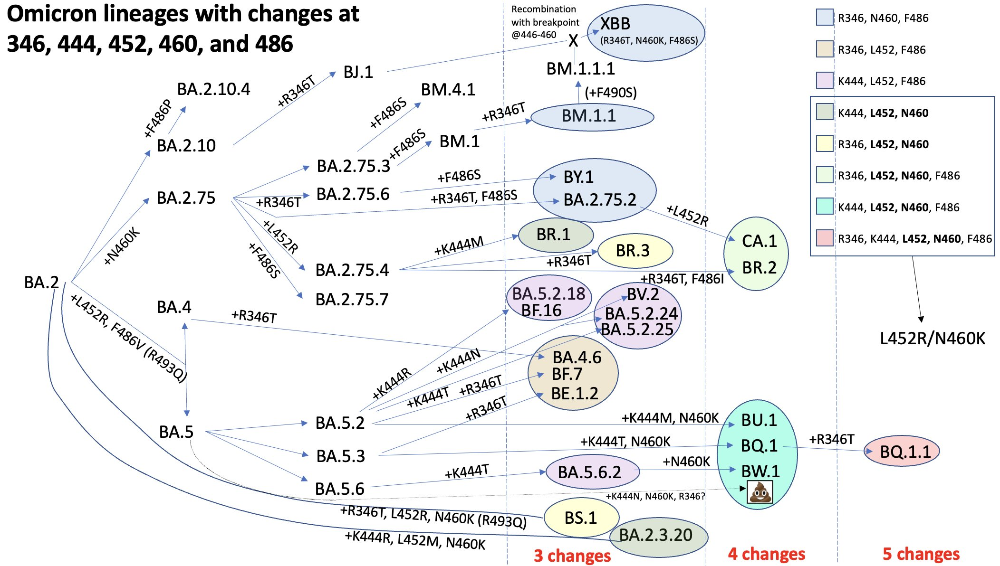

(from <https://twitter.com/SolidEvidence/status/1574040436204871680?s=20&t=bNy5CvKmfDwXOIhIVB6z5g>)

## BA.2.75.2 and other novel lineages show significant immune escape

Yunlong Richard Cao has shared a vast amount of experimental data on neutralization titers and ACE2 binding affinities for most of the lineages mentioned in this report. BA.2.75.2 appears to be the most immune evasive to date, with BQ.1(.1) also showing significant escape:

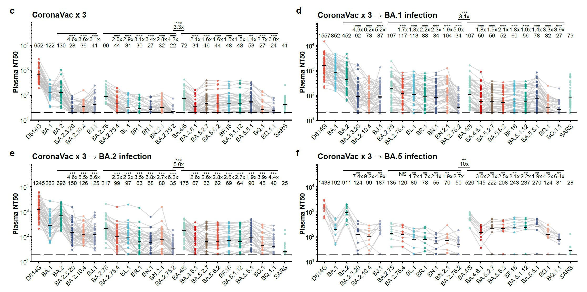

Unfortunately, BQ.1.1 escapes both evusheld and bebtelovimab:

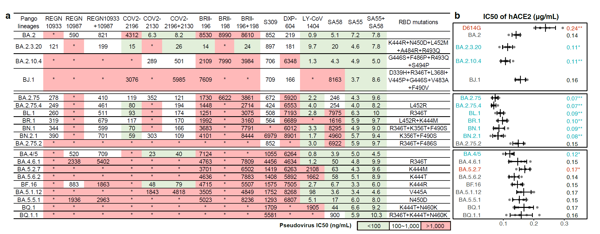

For more details see their preprint: <https://t.co/itJGuLfW3y>

# Variant report 2022-09-14

## A variant wave is likely to start in at most 3 months

The BA.2.75 sublineage BA.2.75.2 (S:346T, S:486S, S:1199N) currently doubles in share every week (+80-120%). It made up between 0.1 and 0.5% in samples from two weeks ago in Europe (in Asia, North America and Oceania, the share is higher at between 0.5-5%).

- [Global Cov-Spectrum query](https://cov-spectrum.org/explore/World/AllSamples/Past6M/variants?nextcladePangoLineage=BA.2.75.2*&)
- [Europe Cov-Spectrum query](https://cov-spectrum.org/explore/Europe/AllSamples/Past6M/variants?nextcladePangoLineage=BA.2.75.2*&)

If this growth trend continues, this variant will dominate in about two months.
At this point, the growth advantage would manifest in increased overall growth in incidence and a variant wave would start around November - on top of the expected seasonal acceleration of transmission.

The growth advantage over resident BA.2 or BA.5 lineages is of the same order of magnitude as was the case when  BA.5 displaced BA.2, which was sufficient to cause a summer wave.

Currently, BA.2.75.2 is the fastest growing lineage with more than 350 sequences available. The rest of this report will focus on other lineages that may end up growing faster than BA.2.75.

## BQ.1 - a BA.5 descendant - may outcompete BA.2.75.2

For a while it appeared as if S:346T was the major beneficial mutation that BA.5 could pick up. BQ.1 shows that this is not the case.

BQ.1 stands for BA.5.3.1.1.1.1.1. It has two RBD mutations on top of BA.5's: S:K444T (defining BA.5.3.1.1.1.1 or BE.1.1.1) followed by S:N460K (defining BQ.1 alias for BE.1.1.1.1). BQ.1 is notable in that it has picked up beneficial mutations in a step wise manner (as is evident in the long Pango name). In contrast to BA.2.75 and other 2nd generation BA.2, it does not lie on a long branch.

BQ.1's parent BE.1.1.1 was most commonly detected in Nigeria as early as July. It is also Nigeria where BQ.1 was first sequenced. It is important to note that sequencing activity in West African countries neighbouring Nigeria is very low so that Nigeria is not necessarily the country of origin - reminiscent of the situation with South Africa and Omicron.

On the 14th of September 2022, 119 sequences BQ.1 sequences had been uploaded to GISAID. The most recent 50 in just the last 3 days. The most recent 100 in just the last 9 days. This is suggestive of a large growth advantage that is difficult to estimate precisely but of similar magnitude to BA.2.75.2.

Importantly, BQ.1 has already picked up S:R346T in a lineage called BQ.1.1, which plausibly increases the growth advantage further. 26 out of 29 sequences of BQ.1.1 have been uploaded in the past 7 days.

It is possible that BQ.1 or BQ.1.1 may outcompete BA.2.75.2, which could result in co-circulation of multiple lineages during a wave or double peak waves as seen with BA.1 or BA.2.

## S:N460K emerged in multiple new lineages

A mutation that both BA.2.75 and BQ.1 have in common is S:N460K. This mutation is also present in two 2nd generation BA.2 variants: BA.2.3.20 and BS.1 (=BA.2.3.2.1).

BA.2.3.20 was first mentioned in last fortnight's report. On top of the BA.2 spike mutations it has: S:M153T, S:N164K, S:H245N, S:G257D, S:K444R, S:N450D, S:L452M, S:N460K S:E484R and the typical S:R493Q reversion.

To date, there are 20 sequences on GISAID, of which 13 have been uploaded in the past 7 days. The first sequence was uploaded 16 days ago. This is suggestive of a large growth advantage, that cannot however be estimated to allow comparison with BQ.1 and BA.2.75.2.

A lineage called BS.1 (=BA.2.3.2.1) has recently been detected in travellers to Japan coming from Vietnam. To date there are 5 sequences of this lineage in GISAID. In addition to the S:R493Q, additional spike changes relative to BA.2 are: S:Y144-,S:G257V,S:R346T,S:L452R,S:G476S,S:N460K,S:S640F.

BJ.1 and BA.2.10.4, two 2nd generation BA.2 mentioned 4 and 6 weeks ago, appear to have growth advantages that don't exceed ordinary BA.5 by much and are hence do not appear of concern regarding dominance - at least as long as they do not pick up further mutations.

# Variant report 2022-08-31

## BA.2.75 is rapidly picking up multiple beneficial spike mutations

It increasingly looks like BA.2.75\* may dominate even the fittest BA.5\* lineages because it is picking up beneficial spike mutations at a faster rate. While the BA.2.75\* founder virus itself could be less fit than the fittest BA.5\* sublineages like BF.7\* (BA.5.2.1 with S:R346T), BA.2.75 has rapidly picked up multiple beneficial spike mutations.

In particular subsets of the following S1 mutations have been picked up by various lineages that have arisen from the BA.2.75 polytomy:

- S:R346T (defining mutation of BL.1=BA.2.75.1.1, one of 3 defining mutations of BA.2.75.2, very homoplasic, growth advantage: 4-8%/day)
- S:K356T (defining mutation of BA.2.75.5, growth advantage: 5-10%/day)
- S:F486S (one of 3 defining mutations of BA.2.75.2, appears homoplasically in BA.2.75.3, growth advantage: 5-10%/day)
- S:D574V (defining mutation of BA.2.75.1, growth advantage: ~3-4%/day)

While the growth advantages of the above mutations on their own are roughly in line with growth advantages conferred in BA.4/5 sublineages, what makes BA.2.75\* different from BA.4/5\* is that BA.2.75\* is picking up multiple beneficial spike together.

The evolution of BA.2.75* is convergent to BA.4/5 as BA.4/5 itself has S:F486V and has repeatedly picked up S:R346T. By analogy, there is thus some hope that the repertoire of beneficial mutations is more or less exhausted by the above mutations.

## Sublineages of BA.2.75 to watch

The following sublineages of BA.2.75 deserve attention as they are the most obvious candidates to become dominant in the next few months (BA.2.75 has comparative fitness to BA.5*):

- BA.2.75.2 (S:346T, S:F486S, S:D1199N): growth advantage over BA.2.75 (~10-15%/day)
- BL.1 (S:D574V, S:R346T): growth advantage over BA.2.75 (~5-10%/day)
- BA.2.75.3 (S:K356T): growth advantage over BA.2.75 (~5-10%/day)

A growth advantage of 10%/day means it takes ~6 weeks from 1% share to 50%, (5%/day -> ~3 months, 3% -> ~5 months), if the growth advantage of the above lineages hold up, BA.2.75\* could become dominant globally (including Europe) by the end of October.

The figure below shows how BA.2.75\*with at least two out of the 4 mutations mentioned in the first section is growing fast in comparison to all BA.2.75\*, within 1 month from first observation, these lineages have grown to >10% of BA.2.75*:

## Recommended tool to monitor the latest designated lineages

The volunteer Federico Gueli maintains a very helpful covSpectrum collection of recently designated lineages, including the candidates for dominance at:
<https://cov-spectrum.org/collections/24>

It is suggested to sort the list descending by `CI (low)` to counter the bias of new lineages having inflated growth advantage estimates.

By default, the growth advantage is relative to all sequences - but the baseline can be changed to e.g. BA.5*, or BA.5* & S:346T.

The region can be chosen as desired, for example Europe, to focus on what happens locally.

Here is the table with worldwide data and baseline BA.5*\

## Spike mutations that seem to confer growth advantages to BA.5

Given that the variant surveillance community tries to designate all lineages with significant growth advantages, the defining mutations of recently designated lineages can be taken as a proxy for mutations that seem to confer growth advantages to BA.5. The following mutations show up repeatedly:

- S:R346T (most prominently in BA.2.75.2, BL.1, BA.4.6, BF.7, BF.11, BE.1.2, BA.5.2.6)
- S:R346S (most prominently in BA.4.7, BF.13)
- S:444M (BA.5.2.7)
- S:444T (BE.1.1.1, BA.5.6.2)
- S:444R (BF.16)
- S:450D (BA.5.5.1, BF.14)
- S:1020S (BF.3.1, BF.5)

Currently, there does not seem to be much space for BA.4/5* to move beyond picking up S:346T or similar single mutations. This makes it more likely that BA.2.75 or another yet unknown sublineage of BA.2 will become dominant in the next few months.

## Recent Pango proposals of interest

### South East Asian BA.2.3 sublineage with 10 convergent S1 mutations

Ryan Hisner has proposed a highly S1 mutated BA.2.3 sublineage that appears to be have its origin somewhere in South East Asia, possibly Malaysia or Indonesia: <https://github.com/cov-lineages/pango-designation/issues/1013>

It is unfortunately not (yet) possible to tell the growth advantage of novel lineages just from looking at the Spike profile if there are so many of them. But the simultaneous discovery on 3 continents with collection date <2 weeks ago and low diversity are what one would expect to see from a lineage with high growth advantage. This should be monitored.

# Variant report 2022-08-17

## S:R346T confers significant growth advantage to BA.4/5, projected to become dominant in October

BA.4 and BA.5 lineages that have the S:R346T substitution continue to grow faster than their siblings without the substitution. (S:R346K was the defining mutation of BA.1.1 that became dominant in a large number of countries before BA.2 took over)

The substitution S:R346T and related ones to I, S and K have appeared numerous times independently in BA.4 and BA.5. These are the ones designated by Pango thus far:

- BA.4.6 (T)
- BA.4.1.8 (T)
- BA.4.7 (S)
- BF.7 (T, alias for BA.5.2.1.7)
- BF.11 (T, alias for BA.5.2.1.11)
- BF.13 (S, alias for BA.5.2.1.13)
- BE.1.2 (T, alias for BA.5.3.1.2)
- BA.5.9 (I)

While BA.4.6 is the single most common BA.4/5 lineage with S:346, it has a growth disadvantage compared to BA.5 lineages with the same mutation, due to the fact that BA.4 has a general growth disadvantage against BA.5. This is immediately evident considering that BA.4\* started out slightly more common than BA.5\* in April 2022 it is now more than 10 times less common.

Globally, BA.5 with S:R346T is expected to become more common than BA.4 with S:R346T in sequences from this month - although there are naturally regional variations. For example, in Belgium BA.5 with S:R346T is already much more common than BA.4 with S:R346T while in the US the BA.4 lineages are still more frequent.

_Figure 1: BA.5 with S:R346T is overtaking BA.4 with S:R346T on a global level, source [covSpectrum](https://cov-spectrum.org/explore/World/AllSamples/Past6M/variants?variantQuery=nextcladePangoLineage%3ABA.4*+%26+S%3A346T&variantQuery1=nextcladePangoLineage%3ABA.5*+%26+S%3A346T&analysisMode=CompareEquals&)_

If evolution was frozen with only existing lineages, BA.5 + S:346T would be expected to become the dominant variant approximately in October 2022. BA.5 + S:346T made up around 1% in European countries at the end of July.

Of course, other fitter lineages, be it sublineages of BA.4/5, of BA.2 (e.g. BA.2.75) or other variants may evolve at any time so these projections need to be read with appropriate caution.

## BA.2.75 now dominant in India, has acquired extra spike mutations in some lineages

### Global spread of BA.2.75

BA.2.75 has continued growing in share in India and has been dominant since the end of July, despite the presence of BA.5.

Other countries where BA.2.75 has established itself at levels >1% at the beginning of August are:

- Nepal (>50%)
- Singapore (~10%)
- Australia (~2%)
- Japan (~1%)

While BA.2.75 is most common in Asia and Oceania, its share is increasing in all countries that have submitted large amounts of recent sequences. However, the share of BA.2.75 in Europe and North America is too small (~0.1-1%) to be able to confidently compare growth advantages of BA.2.75 and the fittest BA.5 lineages.

### Extra spike mutations in BA.2.75

With more than 3000 sequences of BA.2.75 available, it is now possible to analyse intra-lineage diversity. Due to challenging sequence quality, only 1 sublineage has been designated so far (BA.2.75.1 with S:D574V).

BA.2.75 with S:D574V, designated as BA.2.75.1, is apparently increasing in share making up ~40% of recently uploaded BA.2.75\*. Based on relatively noisy data, BA.2.75.1 seems to have a growth advantage of ~4-6% - corresponding to a doubling in share every 2-3 weeks. This lineage is not localized in any particular country and has been detected in most places that have sequenced BA.2.75. S:574 substitutions have only rarely been observed in the pandemic thus far - usually as S:D574Y in a handful of Delta sublineages in countries like Portugal, France and Denmark. In more than 12 million sequences, S:D574V has occurred less than 200 times outside of BA.2.75.

Maybe unsurprisingly, BA.2.75\* has already independently acquired S:346T twice, once in BA.2.75, once in BA.2.75.1. With less than 100 BA.2.75 + S:346T sequenced to date, it is too early to estimate the growth advantage (or disadvantage) this mutation might confer - but it is not unlikely to be of similar magnitude as in BA.4/5*. S:346T is present in around 3% of all BA.2.75\*.

Other notable spike mutations detected internationally and at least ~15 times (i.e. in >0.5% of BA.2.75\*) are:

- S:K356T (~1%)
- S:L452R (~0.5%, known from Delta)
- S:F486S (~1%, similar to S:F486V known from BA.4/5)

Even if no other novel variant evolves, the large number of sublineages that have arisen and will arise in BA.5 and BA.2.75 make it difficult to predict with confidence whether a BA.5 or BA.2.75 lineage becomes dominant in Autumn/Winter in Europe. Both outcomes seem possible though BA.5 has a considerable head start - being the currently dominant variant in Europe.

## Developments outside of BA.4/5 and BA.2.75

Some of the novel lineages that have been discussed in the previous report have recently been designated:

- BA.2.10.4: BA.2.10 + W64R, 141-144del, 243-244del, G446S, F486P, R493Q, S494P, P1143L ([Pango issue #898](https://github.com/cov-lineages/pango-designation/issues/898))
- BA.2.38.2: BA.2.38 (=S:417T) + 157S, 444N ([Pango issue #828](https://github.com/cov-lineages/pango-designation/issues/828))
- BA.2.38.3: BA.2.38 (=S:417T) + 69/70del, 71F, 452Q, 446S, 478R, 1264L ([Pango issue #840](https://github.com/cov-lineages/pango-designation/issues/840))

In addition, the following recently designated lineage is of interest due to its large number of Spike mutations:

- BJ.1: BA.2.10.1 + S:V83A, H146Q, Q183E, V213E, G339H, R346T, L368I, V445P, G446S, V483A, F490V, G798D, S1003I ([Pango issue #915](https://github.com/cov-lineages/pango-designation/issues/915))

None of these seem to show rapid growth but it is too early to exclude the possibility that they may be or become competitive with BA.4/5 and BA.2.75.

# Variant report 2022-08-03

## BA.2.75 outcompetes BA.5 in India

BA.5 continues to dominate in all countries with recent sequences apart from India/Nepal where BA.2.75 is becoming dominant.

As of 2022-08-03, there are around 1400 sequences of BA.2.75 on GISAID, almost 3 times as many as 14 days ago.

In India BA.2.75 has a large growth advantage over its ancestor BA.2 (16-17%/day) and a modest growth advantage over BA.5 (4-6%) as shown by [Tom Wenseleers](https://twitter.com/TWenseleers) using a hierarchical regression model that has performed well with past variants. For countries outside of India sequence numbers are still too small to distinguish conclusively between growth due to important and intrinsic growth advantage.

To put this into context, for BA.2.75 to grow from 0.1% to 50% in a background of BA.2 it would take around a month (this is approximately what is happening in India). In a background of BA.5, assuming growth advantages globally are the same as in India, it would take BA.2.75 about 3 months to grow from 0.1% of all sequences to 50%.

So while BA.2.75 seems to start driving a wave as visible in positivity rate attributed to variants, any potential BA.2.75 wave in e.g. Europe is still 2-3 months away and would be much less drastic than the wave caused by BA.1 vs Delta (~20% daily growth advantage), BA.2 vs BA.1 (~10% daily growth advantage) and BA.4/5 vs BA.2 (~10% daily growth advantage). Of course, it is possible that the BA.2.75 growth advantage vs BA.5 is India-specific and/or that another variant will evolve (either from BA.2, from BA.5, even BA.1 or non-Omicron) so that there will never be a BA.2.75 wavelet.

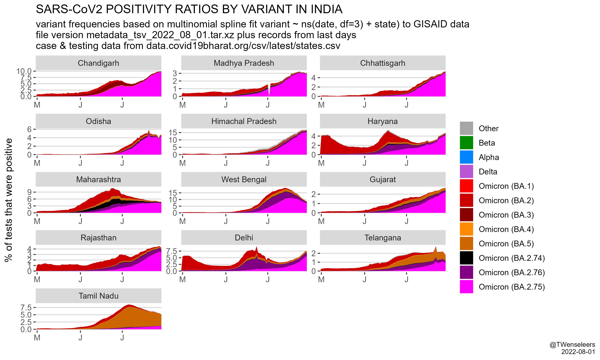

[Cov-Spectrum link with BA.2.75 in India](https://cov-spectrum.org/explore/India/AllSamples/Past3M/variants?variantQuery=NextcladePangoLineage%3ABA.2.75)

[Link to Twitter thread with figures](https://twitter.com/TWenseleers/status/1554189987586908161)

## Intra-Omicron recombinants keep appearing but so far with limited growth advantages

Recombinants containing BA.4/5-Spike have been identified recently but until now, no identifiable recombinants have become dominant at least regionally. It is possible that the various BA.1/2/3/4/5 involve recombination events but in these cases the parents are not clearly identifiable, separate lineages.

## BA.5 has small but definite growth advantage over BA.4

Despite BA.5 and BA.4 being very closely related, BA.5 has become dominant over the past few months. When BA.4 and BA.5 were first discovered, BA.4 was about 3 times more common than BA.5. This has now inverted, with BA.5 being 2-10x more common than BA.4, depending on the region. This translates to a daily growth advantage of about 1-3%.

## BA.4/5 sublineages with small to moderate growth advantages are appearing

A number of BA.4/5 sublineages that seem to show growth advantages compared to their parents have been identified.

BA.4.6 has an additional S:R346T (S:R346K was what conferred BA.1.1 a moderate growth advantage over BA.1) and seems to grow about 5%/day faster than BA.4. BA.4.6 is most common in North America (~3000 sequences as of 2022-08-03), making up around 20% of BA.4 in the US mid July, up from 1% mid May. Prevalence is around 1% in Europe in mid July.

Importantly, the growth advantage that BA.4.6 has over BA.4 (~5%/day) outweighs the growth disadvantage that BA.4 has against BA.5 (~1-3%/day), making BA.4.6 fitter than basic BA.5. BA.4.1.8, an independent BA.4 sublineage also has S:R346T and the concomitant growth advantage but has not been sequenced as often. It is most common in South Africa.

There are a number of BA.5 sublineages that have independently acquired mutations at S:346, e.g. BF.7 (=BA.5.2.1.7, S:346T) with ~600 sequences mostly from Belgium, BA.5.9 (S:346I) with ~600 sequences mostly from Germany.

Generally, BA.5.2.1 (aliased to BF for sublineages) seems to have a slight growth advantage over other BA.5 branches - despite not having any additional Spike mutations.

There are BA.4/5 sublineages with other Spike mutations, sometimes multiple Spike mutations, but the pattern is so far not as clear as for S:346 and all these lineages have not yet surpassed 1% even in the countries where they are most common.

## BA.2 with multiple spike mutations keep emerging

BA.2 sublineages with multiple Spike mutations keep emerging, mostly from India, but none of these seem to be able to compete with BA.5 and BA.2.75. In some cases the clusters are too small to be able to reliable say anything about the growth advantage.

To give some idea of the Spike profiles, here are a few interesting lineages:

- BA.2.10 + W64R, 141-144del, 243-244del, G446S, F486P, R493Q, S494P, P1143L [Pango issue #898](https://github.com/cov-lineages/pango-designation/issues/898)
- BA.2.38 (=S:417T)+ 69/70del, 71F, 452Q, 446S, 478R, 1264L [Pango issue #840](https://github.com/cov-lineages/pango-designation/issues/840)
- BA.2.38 (=S:417T)+ 157S, 444N [Pango issue #828](https://github.com/cov-lineages/pango-designation/issues/828)

# Variant report 2022-07-20

## Dominant variants

BA.5 is dominating waves on all continents, together with BA.4 which is slightly less fit than BA.5 but with identical Spike so very similar.

BA.2.12.1 still makes up a good share in North America but getting replaced by BA.4/5. It's also present with smaller share around the world where BA.4/5 also replaces it.

BA.2\* that is not BA.2.12.1 made up 1-10% around the world at the end of June, with the notable exception of India where BA.2\* makes still up ~90% (and countries without much sequencing for which these statements are not possible to be made).

BA.1 only appears occasionally, in sequences that often show signs of persistent/chronic infection.

## Variants to watch out for

India has never had significant BA.1 circulation. Many fit BA.2* lineages are present there.

### BA.2.75 (S:K147E,S:W152R,S:F157L,S:I210V,S:G257S,S:G339H,S:N460K,S:G446S)

BA.2.75 seems able to compete with BA.5 in India. It was introduced or emerged later than BA.5 (first sequence end of May) and its frequency seems to range between 10-50% depending on state at beginning of July.

BA.2.75 has 9 Spike amino acid substitutions relative to BA.2 (including reversion to wild type at 493) compared to the 3 substitutions (including reversion 493) plus one 2 AA deletion (S:69/70del) for BA.4/5, making BA.2.75 the most diverged Omicron variant with significant circulation to appear since BA.1/BA.2/BA.3.

BA.2.75 does appear to circulate globally, albeit at such low share that it is not possible to say much about growth advantage outside of India.
Countries with clusters of BA.2.75 include: UK, US, New Zealand, Japan, Indonesia, Germany, Israel.
Countries that are known to have exported cases are: Nepal/India (for many Japanese airport surveillance cases), France (for some Israeli cases)

<https://cov-spectrum.org/explore/World/AllSamples/Past3M/variants?variantQuery=NextcladePangoLineage%3ABA.2.75>

India has many states with different sampling practices so one needs to be cautious when interpreting aggregate growth advantages.

Nonetheless, the apparent growth advantage of BA.2.75 over BA.5\* at whole country aggregate level in India is compatible with a significant growth advantage. It is important to note that the statistical uncertainty does not account for systematic errors like biased sampling. The real uncertainty is much bigger than the range 81-138%.

An up to date version of this graph can be found [here](https://cov-spectrum.org/explore/India/AllSamples/Past3M/variants?variantQuery=NextcladePangoLineage%3ABA.5*&variantQuery1=NextcladePangoLineage%3ABA.2.75&analysisMode=CompareToBaseline&)

### Selection of other interesting lineages

Many interesting BA.2 sublineages have appeared first in India. Here is a selection of some to watch. The mutations they carry are typical of BA.2 sublineages with (potential) growth advantages, in India and also globally.

#### BA.2.76 (S:R346T, S:Y248N)

<https://github.com/cov-lineages/pango-designation/issues/787>

<https://cov-spectrum.org/explore/World/AllSamples/Past3M/variants?pangoLineage=BA.2.76>

#### BA.2.38.1 (S:N417T, S:S247N, S:Y248S, S:K444N)

<https://github.com/cov-lineages/pango-designation/issues/809>

<https://cov-spectrum.org/explore/World/AllSamples/Past3M/variants?pangoLineage=BA.2.38.1>

#### BA.4.6 (S:346T)

<https://cov-spectrum.org/explore/World/AllSamples/Past6M/variants?aaMutations=S%3AR346T%2CN%3A151S%2CORF7b%3AL11F&nucMutations=12160A%2CC8140T>

## Latest developments

### South African pair of complex recombinant clusters

Two related clusters of complex Delta/BA.2 recombinants (C1 with 5 sequences and C2 with 4 sequences) have appeared in Gauteng/Limpopo (bordering region).
The Spikes are mostly identical, the rest of the genomes have multiple different breakpoints.

The Pango designation issue, with discussion about this lineage:
<https://github.com/cov-lineages/pango-designation/issues/844>

**Figure showing the recombination patterns for C1 and C2 across the genome**

(Tom Peacock, private communication)

**Figure showing how mutations in C1 compare to other variants**

**Same figure but with different annotations**

(from <https://www.nicd.ac.za/wp-content/uploads/2022/07/Update-of-SA-sequencing-data-from-GISAID-15-July-2022.pdf>)

### German BA.2/BA.1/BA.2 recombinant with convergence to BA.2.75

A BA.2/BA.1/BA.2 recombinant with many mutations of interest has appeared in Germany with 27 sequences to date and spread across Europe.

First sequence beginning of June.

Spike shows the following changes compared to BA.2:

- Missing: T19I, 24-26del, 27S not there because that part is from BA.1* parent
- Donated: 69-70del convergent with many VOCs
- Additional S:R346K, convergent with BA.1.1
- Additional S:K147E, S:N460K and reverted S:493 convergent with BA.2.75

<https://github.com/cov-lineages/pango-designation/issues/823>

## Trends

There seem to be two ways in which lineages evolve:

1. Stepwise accumulation of mutations with short branches
2. "Saltation" events, where clusters attach only on long branches.

In the past, all VOCs have appeared as saltation events.
Stepwise evolution does take place and is relevant for slow sweeps.
However all fast sweeps have been caused by saltation variants.
This is maybe not surprising as any variant comes out of nowhere and long branches are a result of fast growth.
It is thus not clear which way causality goes.
Shay Fleishon and his team in Israel are analyzing the daily updated Usher tree for new long branches allowing quick detection of potentially fast growing lineages.

Many saltations seem to derive from chronic infections as opposed to fast growing lineages so the ratio of false positives is high.

## Non-exhaustive list of BA.2 mutations to watch

This is a non-exhaustive list of mutations that are appearing repeatedly in lineages with growth advantage on top of BA.2\*:

- S:64R
- S:76
- S:152
- S:153
- S:157
- S:248N/S
- S:346T/S/I
- S:354K
- S:368I
- S:417T
- S:444N/T
- S:446S
- S:449D/S/N
- S:450D
- S:452Q/M
- S:460K
- S:468
- S:478T
